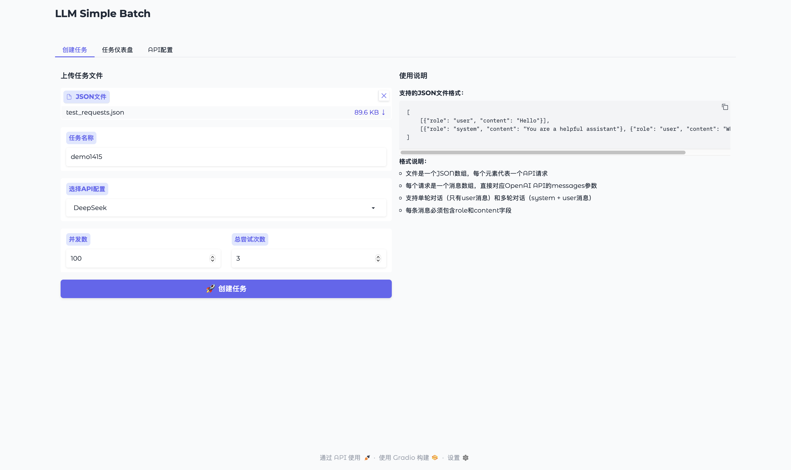
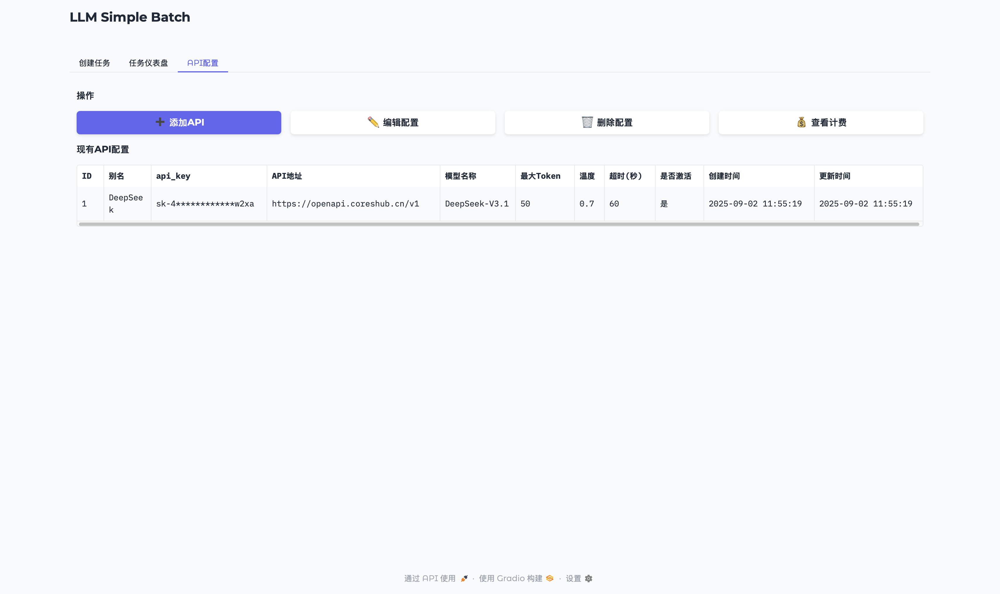
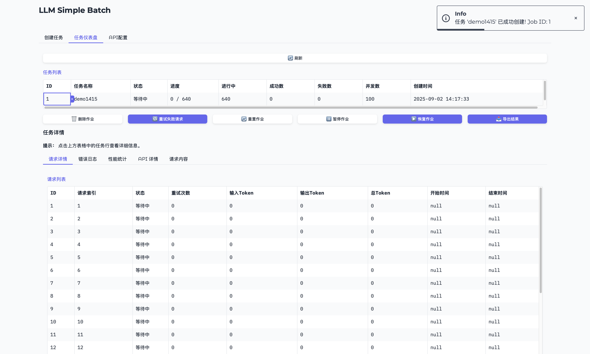
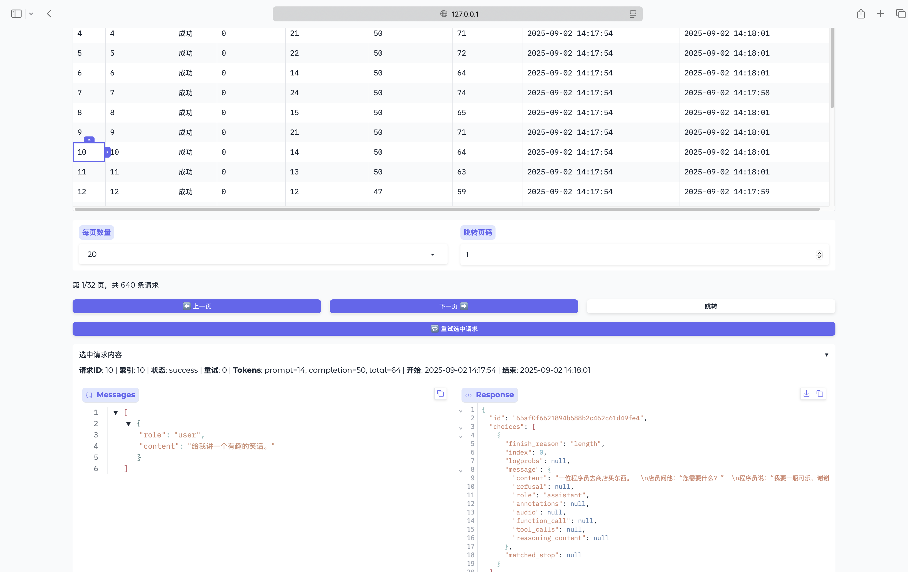
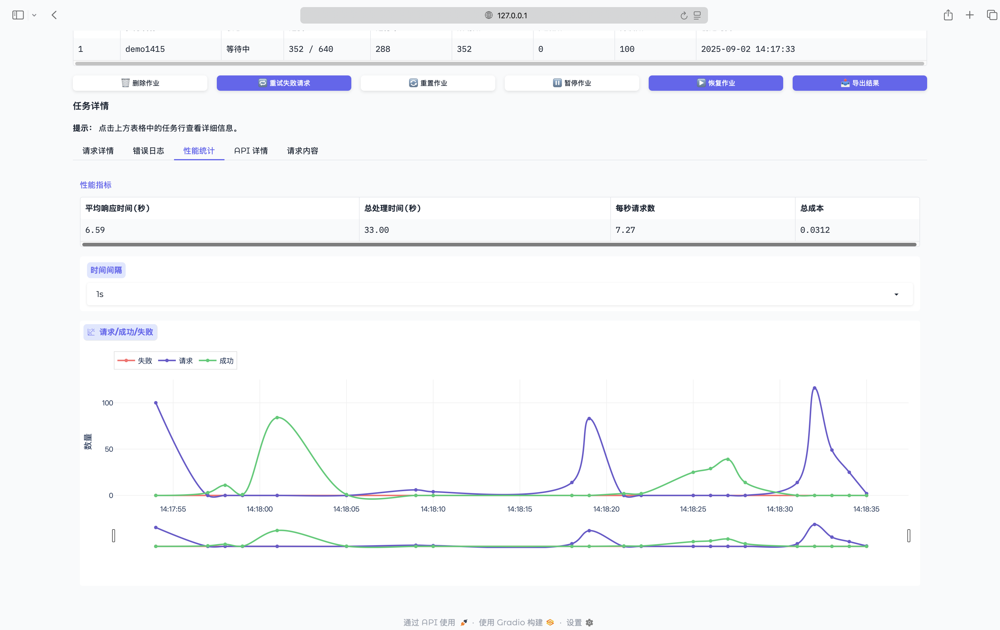
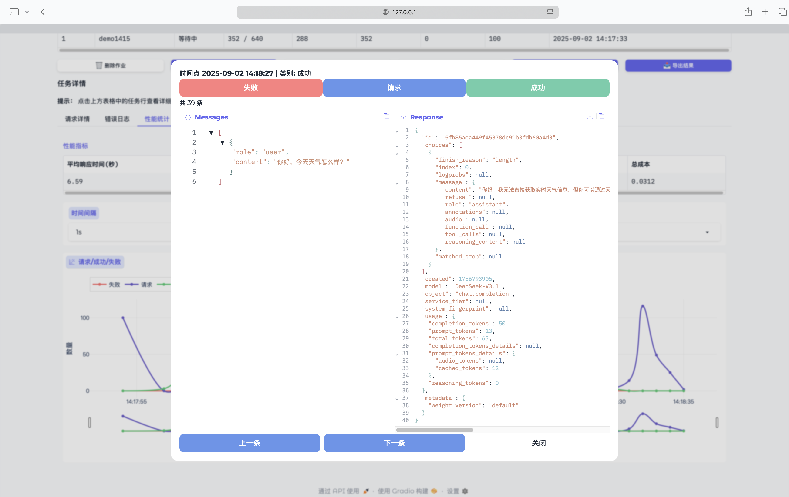
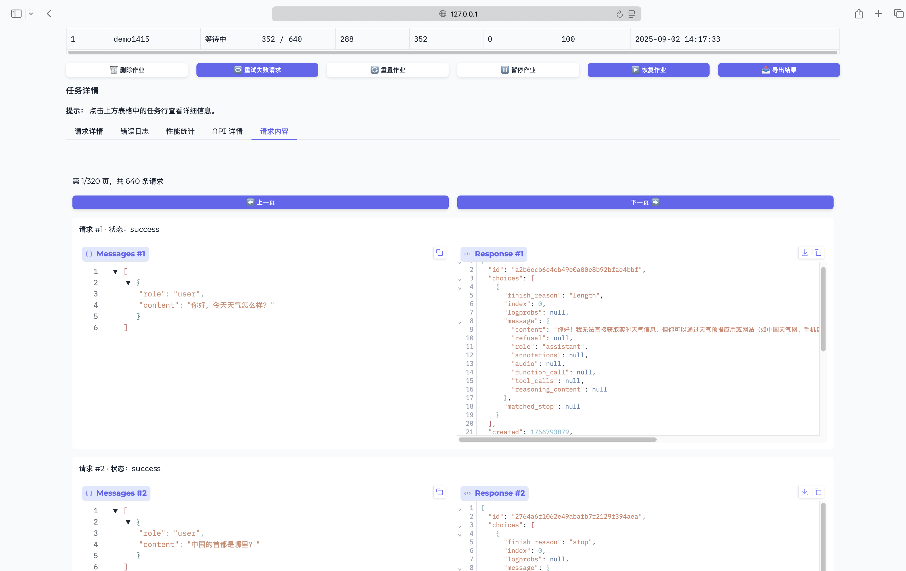

<div align="center">

# 🚀 Simple Batch - AI API 批处理工具

[](https://www.python.org/downloads/)
[](https://www.gnu.org/licenses/agpl-3.0)

一个高效的AI API批处理工具，支持OpenAI兼容接口的批量请求处理，提供直观的Web界面进行任务管理和实时监控。

</div>

## ✨ 主要功能

- 🚀 **批处理管理**：支持大规模API请求的批处理执行
- 🔄 **多API配置**：管理多个AI API配置，支持不同模型和参数
- ⚡ **并发控制**：可配置并发数，提升处理效率
- 🔄 **智能重试**：失败请求自动重试机制
- 📊 **实时监控**：Web界面实时显示处理进度和状态
- 📈 **性能统计**：响应时间、成本分析、请求图表等统计
- 💾 **数据导出**：支持结果导出为JSON格式
- 🐞 **错误日志**：详细的错误记录和分析

## 🖼️ 界面预览

| 功能          | 页面                              |
|-------------|---------------------------------|
| **创建批处理任务** |    |
| **API 配置**  |  |
| **任务列表**    |    |
| **请求详情**    |    |
| **性能统计**    |    |
| **查看图表**    |    |
| **任务内容**    |    |

## 🚀 快速开始

### 1. 获取项目代码

#### 方法一：Git克隆（推荐）
```bash
git clone https://github.com/IrisMagicBox/simple-batch.git
cd simple-batch
```

#### 方法二：下载ZIP
1. 访问 [GitHub](https://github.com/IrisMagicBox/simple-batch)
2. 下载最新版本的ZIP文件
3. 解压到本地目录

### 2. 环境准备

#### 系统要求
- 🐍 Python 3.8+
- 💻 操作系统: Windows / macOS / Linux
- 🛠️ 建议使用虚拟环境

#### 创建并激活虚拟环境
```bash
# 创建虚拟环境
python -m venv venv

# 激活虚拟环境
# Windows
.\venv\Scripts\activate

# macOS/Linux
source venv/bin/activate
```

### 3. 安装依赖
```bash
# 使用默认源
pip install -r requirements.txt

# 或使用清华源加速
pip install -r requirements.txt -i https://pypi.tuna.tsinghua.edu.cn/simple
```

### 4. 启动应用
```bash
python main.py  # 默认端口7861

# 自定义端口和主机
# python main.py --port 8080 --host 0.0.0.0
```

🖥️ **启动成功后**，控制台会显示：
```
2024-09-02 10:00:00 - main - INFO - 数据库初始化完成
2024-09-02 10:00:00 - main - INFO - 调度器已启动
2024-09-02 10:00:00 - main - INFO - 正在启动UI服务器...
Running on local URL:  http://127.0.0.1:7861
```

🌐 打开浏览器访问 [http://127.0.0.1:7861](http://127.0.0.1:7861) 开始使用。


## ⚙️ 配置说明

主要配置文件位于 `settings.py`，以下是关键配置项：

### 数据库配置
```python
# SQLite 数据库文件路径
DATABASE_URL = "batch_processor.db"
```

### API 默认参数
```python
DEFAULT_MAX_TOKENS = 4096     # 默认最大token数
DEFAULT_TEMPERATURE = 0.7     # 默认温度参数
DEFAULT_TIMEOUT = 60          # 默认请求超时(秒)
```

### 批处理设置
```python
DEFAULT_CONCURRENCY = 5       # 默认并发数
DEFAULT_MAX_RETRIES = 3       # 失败请求重试次数
```

### 性能优化
```python
# 缓存设置
REQUEST_CACHE_BATCH_SIZE = 100     # 批量写入数据库的请求数
REQUEST_CACHE_FLUSH_INTERVAL = 5   # 定时写入间隔(秒)
```

> 💡 提示：修改配置后需要重启应用生效

## 📚 使用指南

### 1. 配置API信息

在Web界面中添加AI API配置：

- 🔑 **API密钥**：输入您的API密钥
- 🌐 **API基础URL**：API服务地址
- 🤖 **模型名称**：如 `DeepSeek-V3.1`、`gpt-5` 等
- ⚙️ **参数设置**：
  - 温度 (Temperature)
  - 最大Token数 (Max Tokens)
  - 超时时间 (Timeout)

### 2. 创建批处理作业

1. 📤 上传JSON格式的请求数据文件
2. ⚙️ 选择API配置
3. 🎛️ 设置处理参数：
   - 并发数 (建议<200)
   - 失败重试次数
   - 请求间隔(秒)
4. 🚀 提交作业

### 3. 监控进度

- 📊 **仪表盘**：实时显示处理进度
- 📋 **作业列表**：查看所有作业状态
- 📈 **统计图表**：
  - 平均响应时间
  - Token使用量
- 📝 **日志**：详细的执行日志

### 4. 导出结果

- 💾 **导出格式**：JSON
- 📦 **导出内容**：
  - 完整的请求/响应数据


## 📝 API 请求格式

批处理请求文件应为JSON格式，包含一个请求数组。每个请求对象的结构如下：

```json
[
    [{"role": "user", "content": "Hello"}],
    [{"role": "system", "content": "You are a helpful assistant"}, {"role": "user", "content": "What is AI?"}]
]
```

## 🛠️ 故障排除

### 常见问题

<details>
<summary>🔴 端口被占用</summary>

```bash
# 指定其他端口
python main.py --port 8080

# 或查找并终止占用端口的进程
# Linux/macOS
lsof -i :7861
kill -9 <PID>

# Windows
netstat -ano | findstr :7861
taskkill /PID <PID> /F
```
</details>

<details>
<summary>🔐 权限问题</summary>

```bash
# 确保对项目目录有读写权限
chmod -R 755 /path/to/simple-batch
```
</details>

<details>
<summary>🐍 依赖冲突</summary>

```bash
# 创建新的虚拟环境
python -m venv new_venv
source new_venv/bin/activate  # 或 new_venv\Scripts\activate
pip install -r requirements.txt
```
</details>

<details>
<summary>💾 数据库问题</summary>

```bash
# 备份当前数据库
cp batch_processor.db batch_processor.db.bak

# 删除并重新初始化数据库
rm batch_processor.db
```
</details>

### 获取帮助

- 📂 查看 `logs/` 目录下的日志文件
- 📝 在 [GitHub Issues](https://github.com/IrisMagicBox/simple-batch/issues) 搜索或提交问题

## 🤝 参与贡献

欢迎任何形式的贡献！

1. 🐛 提交 Bug 报告
2. 💡 提出新功能建议
3. 📝 改进文档
4. 💻 提交代码 (Pull Request)

## 📄 许可证

[](https://www.gnu.org/licenses/agpl-3.0)

本项目采用 **GNU Affero General Public License v3.0** 许可证 - 查看 [LICENSE](LICENSE) 文件了解详情。

## Star History

[](https://www.star-history.com/#IrisMagicBox/simple-batch&Date)

> ⚠️ **注意**：使用本工具时，请确保遵守相关AI API服务商的使用条款和限制。